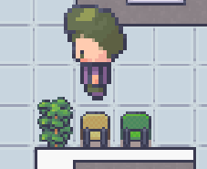
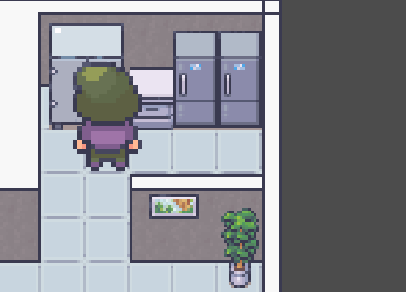
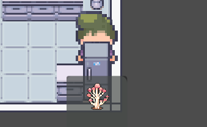
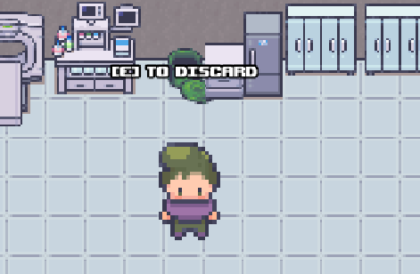
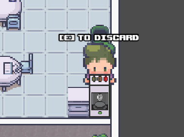

### Tester Name
Josh

### Tester Gaming Experience Level
Long time game player

### Targeted Questions

1. How did the control scheme feel?
    Works nice for keyboard
2. How did you like the overall shape of the level?
    The level seems too big (note: was changed after this test)
3. How did you like the layout of Depos, Fridges, and machines?
    It would be cool to have all things spawn in the same place, specifically the depos.
4. Did you find the counter tops usefull?
    did not notice they could be used.
5. Was the GUI useable?
    the thing above the head is hard to see
    brown clipboard seems out of place
6. Did you prefer the item slot, hovering item, neither, or both?
    No opinion
7. What was the percieved difficulty of the game?
    No commments

### Did the user need help to learn the game mechanics from the test supervisor?
Yes
### Did the user finish level one? How many attempts?
Yes, 2 attempts with help
### Was there any game breaking bugs?
Grabage as a contract item leads to not being able to craft anything
### General feedback/suggestions from the tester:
#### NOTE: This was before the final test version was complete
What am I doing? What is in the fridges? Aliasing looks rough, what do the depos contain before interacting?
Glass doors on the fridge to see the item inside would be nice. Zoom in the camera (note: already implemented post test).
A tutorial would also be nice.

### Tester Name
Luke

### Tester Gaming Experience Level
Long time game player

### Targeted Questions

1. How did the control scheme feel?
    smooth and salf explanitory
2. How did you like the overall shape of the level?
    its a lab
3. How did you like the layout of Depos, Fridges, and machines?
    Lab felt empty
4. Did you find the counter tops usefull?
    Why are they a thing?
5. Was the GUI useable?
    Why is my item shown in both the corner and above my head?
6. Did you prefer the item slot, hovering item, neither, or both?
    Thing above the head feels redundant
7. What was the percieved difficulty of the game?
    Difficulty came from not knowing what is going on, not actual difficulty. Now that game mechanics are known could get a consistent win.

### Did the user need help to learn the game mechanics from the test supervisor?
No
### Did the user finish level one? How many attempts?
Yes, 3 attemps
### Was there any game breaking bugs?
same bugs as already noted
### General feedback/suggestions from the tester:
#### NOTE: This was before the final test version was complete
What is the blue fridge?

### Tester Name
Adam Tilson

### Tester Gaming Experience Level
P.Eng who develops games for fun, more experienced in playing games than the dev team.

### Targeted Questions

1. How did the control scheme feel?
    felt natural
2. How did you like the overall shape of the level?
    The level seems too big (note: was changed after this test)
3. How did you like the layout of Depos, Fridges, and machines?
    3 fridges next to each other was rough
4. Did you find the counter tops usefull?
    did not notice they could be used.
5. Was the GUI useable?
    Did not look at the GUI a lot, so no.
6. Did you prefer the item slot, hovering item, neither, or both?
    both work
7. What was the percieved difficulty of the game?
    not very discoverable
8. What did you find fun?
    #### NOTE: Adam suggested we add this question

### Did the user need help to learn the game mechanics from the test supervisor?
Yes
### Did the user finish level one? How many attempts?
Yes, 2 attempts with help
### Was there any game breaking bugs?
Grabage as a contract item leads to not being able to craft anything
### General feedback/suggestions from the tester:
#### NOTE: Copied from discord.
It is hard to tell that the mixer is a mixer.

He tried to put trash in a decor piece that was not trash.

Tutorial seems to be something that could be very valuable to show new players the basics.

Is there spoilage time on items or bad results of making things.

There is not much sense of urgency (music can help).

Clarify objectives and ensure the players can get through the easy stuff very quickly instead of creeping into more scope of items and recipes and machines.

3 fridges in a line was alot to deal with.

E felt good for grabbing, space for start, wasd for move all good.

Sound can help a lot since the audio feedback can show good or bad. So if garbage is made then it shows a negative feedback sound.

There was pressure but it was hard to notice, there should be something to notify them.

Fix garbage interaction sizing.

Overall: Get as many people as possible, get sound, get chemistry people to play it.

Question marks on how to make stuff instead of showing it on GUI.

A "lectern" to interact with to see recipes.

Hard to tell what is in the fridges (likely fixed with new depos).

Didn't notice the hand in bottom left. Said the floating item was okay.

Tried to interact with some of the decor to mess with it.

Add to user testing: what did you find fun?

### Tester Name
Noah Pennignton
### Tester Gaming Experience Level
Advanced PC gaming ability

### Targeted Questions

1. How did the control scheme feel?
    Controls felt clunky and might be better on a controller
2. How did you like the overall shape of the level?
    Rectangle wasted a lot of time running around, OG map is perfect, "eyeball map" make the hallways a little wider to make it easier to navigate
3. How did you like the layout of Depos, Fridges, and machines?
    Liked the randomness, "fake trash" was a bit painfull, colour did not help make them different, blue fridge is a good stark contrast
4. Did you find the counter tops usefull?
    Once they started being used are nearly essential, the time now for what you are making its nearly essential
5. Was the GUI useable?
    The time looked at once or twice near the end, give a warning at about 4:30, clipboards are nice and fitting
6. Did you prefer the item slot, hovering item, neither, or both?
    above the head is nice, prefer on the head but both are usable
7. What was the percieved difficulty of the game?
    feels more mid game than early game, too hard for the first level
8. What did you find fun?
    the concept is fun, figuring everything out is fun, really enjoy that you don't know what everything is right away. Like the three contract choice.

### Did the user need help to learn the game mechanics from the test supervisor?
Game mechanics felt intuitive, especially for this style

### Did the user finish level one? How many attempts?
6 attempts, completed 4 penicillin
### Was there any game breaking bugs?
Yes, on a new map the depo can be hard to get to because of the thin hallway that requires alignment within a couple px.
### General feedback/suggestions from the tester:
Timer goes behind the head, kinda funky and don't like it.
No audio is strange
codex style recipe book, discover first then put it in, high mental load
clock flash red near midnight in stardew, that would help, tried with controller and felt instantly better

### Tester Name
Phoenix

### Tester Gaming Experience Level
Long time game player

### Targeted Questions

1. How did the control scheme feel?
    Played on keyboard and mouse, felt nice and normal
2. How did you like the overall shape of the level?
    the original lab feels good, the largest lab "does not spark joy", 
3. How did you like the layout of Depos, Fridges, and machines?
    aside from knowing where things are at a glance, its pretty good
4. Did you find the counter tops usefull?
    very: used countertops to solve a lack of ability to see what fridge has what without walking up to it
5. Was the GUI useable?
    don't really notice it
6. Did you prefer the item slot, hovering item, neither, or both?
    both makes sense when there a lot more textures that may be hard to differentiate above the head
7. What was the percieved difficulty of the game?
    Feels like and actual rouge like
### Did the user need help to learn the game mechanics from the test supervisor?
yes, thought there was only one machine, and when was told there was two assumed they did the same thing
### Did the user finish level one? How many attempts?
7 attempts to complete the game using Citric Acid, did not attempt penicillin
### Was there any game breaking bugs?
Player did not expierence any
### General feedback/suggestions from the tester:
Seperator doesn't look like a machine, game feels slow for level 1, enjoy that its a one handed game.
Put items on counter next to the fridge it came from in order to remember what was where.
Why is the player an "absolute unit"?

### Tester Name

Angelo Walsh

### Tester Gaming Experience Level

Gamer

### Targeted Questions

1. How did the control scheme feel?
    Controls felt good overall. However, switching between E and SPACE is somewhat unnatural. It could be the angle of my keyboard, but it just felt awkward. Q perhaps?
2. How did you like the overall shape of the level?
    Levels feel pretty good. I think the hitboxes of the chairs seem realistic but the trees are actually OP. I feel like I have to give an extra space between me and the trees in order to pass properly.
3. How did you like the layout of Depos, Fridges, and machines?
    Felt good. However, I don't think you should let the trash can near any machines as I found in a few runs that the interact radius for the trash ate my product as I was in the final stage.
4. Did you find the counter tops usefull?
    I felt the machines were too quick for me to make a whole lot of use for them. I could get maybe one item near a machine before having to go get product currently cooking.
5. Was the GUI useable?
    UI looks fine. I don't know if it's just me, but the contracts feel too far from the rest of the game? They are just so far out of the way in LaLa land that I can lose focus from the gameplay.
6. Did you prefer the item slot, hovering item, neither, or both?
    I think the item hovering above your head is superior. Keeps you locked in the entire time. My criticism for the item slot is the same as the contracts; it's too far from the action, it's almost distracting trying to use it.
7. What was the percieved difficulty of the game?
    The hardest part of the game is learning the recipes. I made the mistake of trying to do a multi-product contract on my first playthrough and bombed because I kept making garbage.
8. What did you find fun?
    Figuring out how to make a product was fun crossed with frusturating in a good way. Definitely a big fan of the time and space management aspect, although I didn't get to enjoy it as much I wanted.

### Did the user need help to learn the game mechanics from the test supervisor?

No

### Did the user finish level one? How many attempts?

Yes, 5 attempts (2 raw, 2 to learn each recipe, 1 more to compelete)

### Was there any game breaking bugs?

Tree hit box too OP.

There was a case in one of the more blocked off areas that you can't access fridges if they spawn there.

Item name for fridges that spawn at the bottom of the screen are cut off.

Not entirely game breaking, but the trash radius definitely feels bigger than others and likes to override prompts even if I am next to a completely different machine. I don't think it should be allowed to spawn anywhere near countertops or machines, fridges are fine.

### General feedback/suggestions from the tester: Trees are too OP like give me hedge trimmers or some way to get them out of my way.
If you want the counter tops to be used more, I think you need to slow down machine speed. As it stands, I feel like I only have time to grab (maybe) one item before having to hike it back and get the next stage of the recipe going. You may need to slow in-game time down to compensate for this, but it could be worthwhile. Could also increase player speed.

Contracts should be closer to the screen, there is chunk in the middle of my screen on most (if I recall correctly) levels that would be perfect. I then don't have to take my eyes off the game.

Depending on what your goals are for the game, it might be beneficial to add an "intro day" for each new recipe. This day would have no time limit and just the ingredients lying around (like how single recipe contracts are) so that the user can figure out how to make the item without worrying about a fail condition.

I am kind of torn on not knowing what is in each fridge until I walk up to it. While I like the idea of having to remember where everything is to add a layer of difficulty and optimization, it would also be nice to at least have a way to flash the items in the depos. Perhaps, at the start of the round before moving, the user can see what is inside of every fridge and once they move (or a short timer expires) everything is hidden just like the current version of the game; or some kind of ability that can be used to flash the items in each depot. Clear fridge doors would be a last resort IMO.

Not a big deal but being able to recover an item that is in a machine would be nice. A few times I accidentially doubled pressed E on a stage 1 or 2 product and put it back inside, resulting in garbage.

Would be nice:
A way to add more machines to your lab. This could be a purchasable or earnable upgrade.
I understand the RAMS update will add hazards, but I do think a way to investigate or research hazards should be implemented so the player can reduce any penalties that hazard may impose. Also, I think an Ice hazard that makes your characer slip (like in the pokemon games) is a must/classic.
When there are more recipes, adding a free-roam mode that can allow the player to use all ingredients to make any recipe with no time limit.

### Tester Name
Joshua Myslichuk

### Tester Gaming Experience Level
Most of my life so experienced.

### Targeted Questions

1. How did the control scheme feel?
	The control scheme was simple and easy to pick up, however
	collision with objects such as tables felt slightly off.

2. How did you like the overall shape of the level?
	Levels were alright most of the time, tables could feel a bit random
	and perhaps a bit more colour wouldn't hurt.

3. How did you like the layout of Depos, Fridges, and machines?
	they were distinct enough to stand out.

4. Did you find the counter tops usefull?
	they are more useful for large orders or complicated ones
	can help cut down some time.

5. Was the GUI useable?
	For what was there it seems decent I didnt have issues with it.

6. Did you prefer the item slot, hovering item, neither, or both?
	I like the hovering item the most its nice that
	the item is right there for you to see.

7. What was the percieved difficulty of the game?
	I would say the game could be easy to medium difficulty depending on
        the person's ability to problem solve and memory

8. What did you find fun?
	I liked the problem solving aspect and the simplicity of combining items.

### Did the user need help to learn the game mechanics from the test supervisor?
No I did not was not bad to figure out

### Did the user finish level one? How many attempts?
Yes I did after 3 attempts

### Was there any game breaking bugs?
Yes I had an issue with map gen and collision that did not let me access
one of the fridges. This was caused by access to the fridge being a 1x1
path. The path had a small divider wall just under it and with that and
a table by the fridge I could not actually use this 1x1 path. I believe
my character was getting stuck on the table.

### General feedback/suggestions from the tester:
I think the game could be a fun one and obviously needs more to it.
It could be nice to have a system that records recipes once you figure
them out. I also think some more colour to the maps would be nice.

### Tester Name:
Shaun Myslichuk

### Tester Gaming Experience Level:
18 years, older (passed prime) gamer.

### Targeted Questions

1. How did the control scheme feel?
Natural, to a degree. Tooltips certainly aided in control scheme understanding. WASD is the natural method of
movement so that is obvious, as is using E to pick up and drop items. Space bar for starting machines is
different but a control that comes easily with experimentation. Feels odd having the mouse do nothing, however.
Not even a hover tooltip for what is in a machine / fridge.

2. How did you like the overall shape of the level?
Level design was interesting, as in the mental game of route optimization was engaging enough. Sometimes the level
generation would fail to create a completable level, forcing restarts (See Bug Reports). Some levels were rather
constricting in their layouts, having almost too many items spawning in a specific area.

3. How did you like the layout of Depos, Fridges, and machines?
Almost feels like a trash can should be paired per machine, as earlier experimentation proves to produce mostly
"garbage" items that require throwing away. One generation had the garbage can on one extreme end of the map and the
other machines on the complete opposite. Fridge and machine hit-boxes are somewhat smaller, causing one to get
caught while attempting to move after depositing an item.

4. Did you find the counter tops usefull?
Counter-tops proved useful once tester realized that they could be used. Some generations had the countertops come
in handy more than other generations. A very map dependant tool.

5. Was the GUI useable?
The font could be clearer on certain resolutions, on fullscreen it is fine. The only buttons that work are "Play"
and "Quit" on the main menu, to be expected. The gear that most would associate with settings brings the player
back to the main menu which is unexpected. The inability to tell what is inside a machine while it is "mixing" items
hurts while less schooled players attempt to figure out the recipes via trial and error. The Mouse would be a nice
way to tell what is inside machines as it is otherwise useless.

6. Did you prefer the item slot, hovering item, neither, or both?
Hovering item works perfectly fine, works just like classic Harvest Moon. Found the item slot to be superfluous
honestly. If you could store more than one item at a time like in an inventory it would prove more usefull, otherwise
it is not required.

7. What was the percieved difficulty of the game?
The gameplay itself is dead simple, move items into other items in order to create new items to then process and sell.
The actual recipes are a bit more dificult, again, trial and error was mostly used to figure it out. Then again, I
am a bit of a dummy.

8. What did you find fun?
Prioritising the route, attempting to find the best and shortest paths to use for each step. Attempting to use "bake
time" to set up other recipes. Reminded me of the old Diner Dash games, as silly as it may sound. Get the right
things from A to B as quickly as possible.

### Did the user need help to learn the game mechanics from the test supervisor?
Not a test supervisor per-se, but David did help explain a few things, such as the refining machine and the counters
being usable.

### Did the user finish level one? How many attempts?
Yes, too many including my own stupidity running down the clock and also poor level generations causing issues. Some
of the more difficult contracts proved to be, well, difficult within the time constraints. Somebody more intelligent
and / or familiar would have an easier time for sure.

### Was there any game breaking bugs?
Yes, See bug reports.

### General feedback/suggestions from the tester:
A legit seperate sprite for the "Selling / Deposit Box" would be nice but it's functional.
Garbage Cans and Machines perhaps being closer together.
Making the character sprite collision box a little smaller to fit into 1x1 spaces.
"Restart Run" button would be cool but not required. "Restart run" option
Hoverable tooltips on things to know what is in what, specifically machines.
Ties into above but perhaps colour coded fridges? Doesn't have to match items just be unique at a glance.

### Tester Name
David Gibson
### Tester Gaming Experience Level
15 Prior years Experience Playing Games
### Targeted Questions

1. How did the control scheme feel?
    The essentials were covered, It fit the style of the game as a 2-D Recipe Maker.
2. How did you like the overall shape of the level?
    Could at times be chaotic leading to annoying pathing.
3. How did you like the layout of Depos, Fridges, and machines?
    Again Can lead to annoying pathing.
4. Did you find the counter tops usefull?
    Probably not as much as intended. never had enough time to use them. item in item out.
5. Was the GUI useable?
    The buttons that worked, worked.
6. Did you prefer the item slot, hovering item, neither, or both?
    The item slot was preferable. Sometimes the bubble would block my view.
7. What was the percieved difficulty of the game?
    Casual pickup game. easy for beginners so long as theres a recipe to follow.
8. What did you find fun?
    I can't necessarily say i enjoyed my time but i did pass the time with it. Kinda similar to cookout in that way, probably better with friends.

### Did the user need help to learn the game mechanics from the test supervisor?
No
### Did the user finish level one? How many attempts?
Tester took 2 Attempts
### Was there any game breaking bugs?
No Bugs Encountered
### General feedback/suggestions from the tester:
To take the game further you might want to consider adding more variations to the recipes. new machines and possibly a cooperative mode with larger quotas to fill.
If you can get some basic gameplay instructions down somewhere for first time players i think that'll really improve your score as frustration will go down significantly.

### Tester Name
Jacob Sim

### Tester Gaming Experience Level
Long time video game player

### Targeted Questions

1. How did the control scheme feel?
    Feels good, it works
2. How did you like the overall shape of the level?
    Sizes are good, add a little depth and challenge
3. How did you like the layout of Depos, Fridges, and machines?
    Keeps it fresh and new, can't just memorize and create a map
4. Did you find the counter tops usefull?
    They are very usefull
5. Was the GUI useable?
    a little confused when the day ends
6. Did you prefer the item slot, hovering item, neither, or both?
    Didn't notice the hand slot, above the head is all I noticed
7. What was the percieved difficulty of the game?
    Concept is not hard but its hard because there is a lack of understanding very straight forward, not knowing is part of the challenge
8. What did you find fun?
    Mind numbing, if someone handed it to me and said "play it" and have it on the go, maybe not to sit down and play for hours on end but a short term

### Did the user need help to learn the game mechanics from the test supervisor?
Overall purpose of what is happening

### Did the user finish level one? How many attempts?
yes, 2 attempts to complete the first contract

### Was there any game breaking bugs?
Yes, already reported above

### General feedback/suggestions from the tester:
What is going on?
A Tutorial could be helpfull, but don't defeat the purpose of discovering the recipe
Multiplayer would be fun

